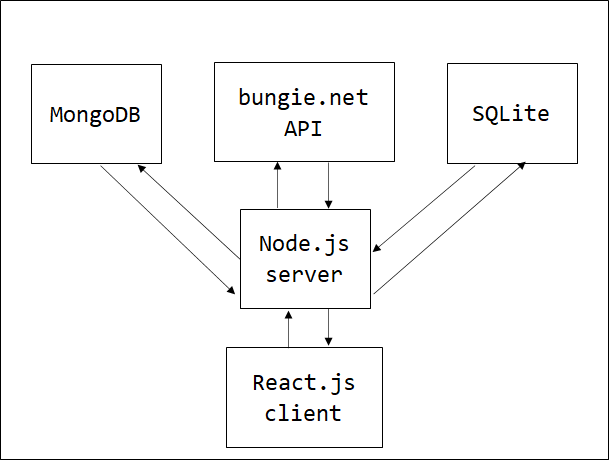
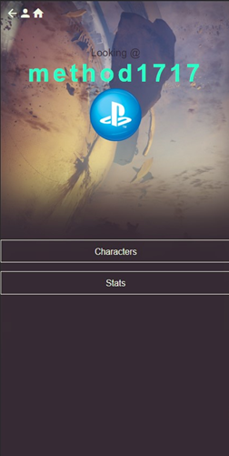
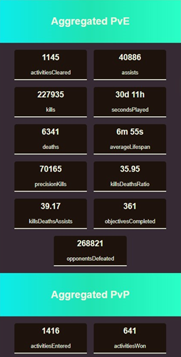
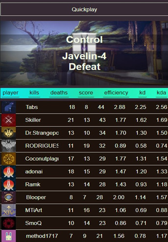

# Project Desc

MERN stack application utilizing data provided by bungie.net API. Player companion functionality.
The application allows users to:

- retrieve information about profile,
- retrieve character information, including equipment,
- browse profile statistics,
- browse match history,
- check match leaderboards,
- login via OAuth 2.0 mechanism.

# Technologies used

- MongoDB
- Express.js
- React.js
- Node.js
- Passport
- Oauth 2.0
- SQLite
- Bungie.net API

# Application architecture overview

# Project preview

